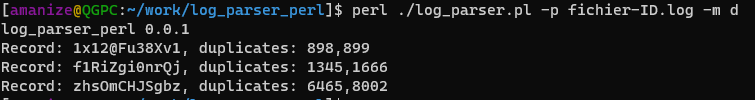
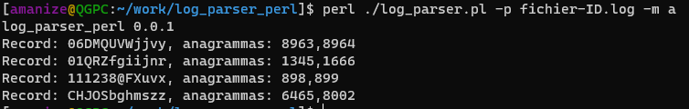
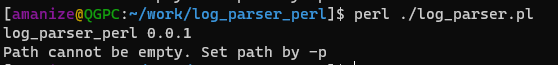

# log_parser_perl

## Description

Simple log parser written on Perl that can find duplicates and anagrammas in logfile.

## Requirements

This app requirs perl 5.38.

How to install perl on required system:

- [install](https://www.perl.org/get.html)

## Run

To run application:

- Install perl by instruction.
- Clone this repo.
- Change current directory to clonned repo dir.
- Run `perl ./log_parser.pl -h`.

This command will show help message for apllication.

## Usage

*log_parser_perl* needs file's path to be provided. Use `-p` to specify valid path.
Application can be started in 2 modes: find duplicates and find anagramas. Use `-m` to specify modes. Available modes: `a` for anagrammas, `d` for duplicates.
To show help message use `-h`.

Complete command to run application in duplicates mode with file `logs.log` that in the same directory with app:

- `perl ./log_parser.plr -p logs.log -m d`

### Example

Example output for duplicates mode:

Example output for anagrammas mode:

Example output for wrong arguments:

### Duplicates

Search of duplicate have 5 steps:

- open file to read.
- read file line by line.
  - put line into hash with readed string as key and push `$.` to value.
- print result
  - check if hash value length by key more than 1, the print.

Reading file line by line has time complexity of O(n).
Putting value in hash has time complexity of O(1).
Printing result has time complexity of O(n).

### Anagrammas

Search of anagrammas have 6 steps

- open file to read.
- read file line by line.
  - split line to characters.
  - sort received character by lexicographic order.
  - put sorted line into hash with readed string as key and push `$.` to value.
- print result
  - check if hash value length by key more than 1, the print.

Reading file line by line has time complexity of O(n).
Sorting array of charactes has time complexity of O(N log N) in worst case: O(N^2), according to [doc](https://perldoc.perl.org/sort).
Putting value in hash has time complexity of O(1).
Printing result has time complexity of O(n).
